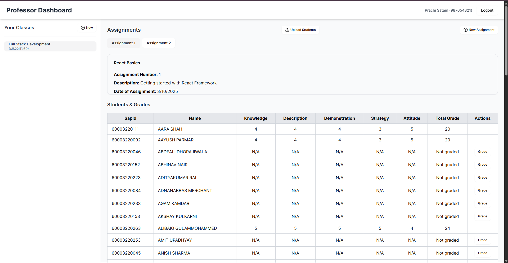
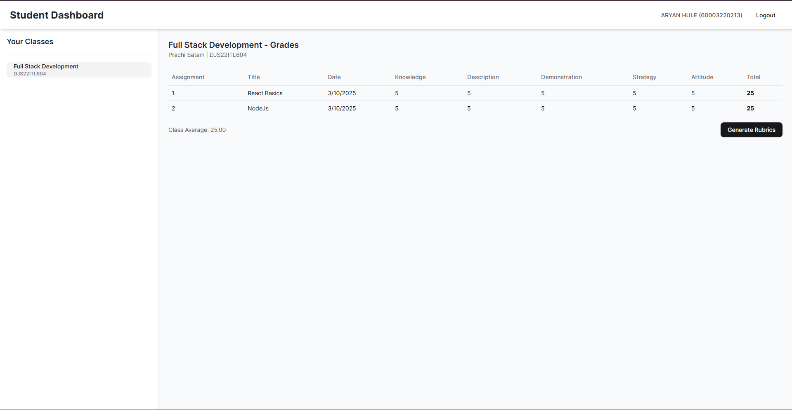
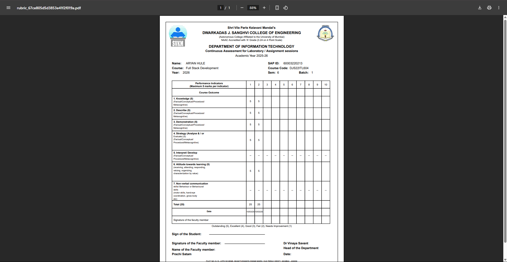

# Rubric Automation System

A web-based application designed to automate rubric generation and student assessments. This system streamlines the evaluation process for professors and provides students with clear, structured feedback on their performance.

## 🚀 Features

### 👨‍🏫 Professors:
- **Create & Manage Classes** – Set up courses with unique access codes for students.
- **Assignment Management** – Add and organize assignments throughout the semester.
- **Rubric-Based Grading** – Assess students based on:
  - Knowledge
  - Description
  - Demonstration
  - Strategy
  - Attitude towards learning
- **Score Storage & Reports** – Securely store grades and generate **printable rubric reports**.

#### 📸 Feature Screenshots
_Add relevant screenshots for each feature below_




### 🎓 Students:
- **Join Classes** – Enter access codes to enroll in courses.
- **View Grades** – Check assignment scores and feedback.
- **Generate Rubrics** – Download and print performance reports.

#### 📸 Feature Screenshots
_Add relevant screenshots for each feature below_



## 🏗️ Tech Stack
- **Frontend:** React.js (Responsive UI)
- **Backend:** Node.js / Express.js
- **Database:** MongoDB
- **Authentication:** SAP ID & Password
- **Deployment:** TBD

## 📸 Screenshots
_Add additional UI previews here_


## 🛠️ Installation & Setup

### Prerequisites
- Node.js & npm installed
- MongoDB installed and running

### Steps
```sh
# Clone the repository
git clone https://github.com/your-repo/rubric-automation.git
cd rubric-automation

# Navigate to backend and install dependencies
cd Backend
npm install

# Start the backend server
node server.js

# Navigate to frontend and install dependencies
cd ../Frontend
npm install

# Start the frontend server
npm run dev
```

## 🚀 Future Enhancements
- PDF Export for Rubrics
- AI-based Automated Feedback
- Graphical Analytics for Performance Tracking

## 📜 License
MIT License

## 🤝 Contributing
Pull requests are welcome! Feel free to submit issues and suggestions.

---

Made with ❤️ by [Aryan Hule]
